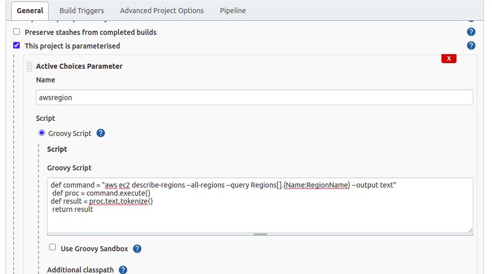
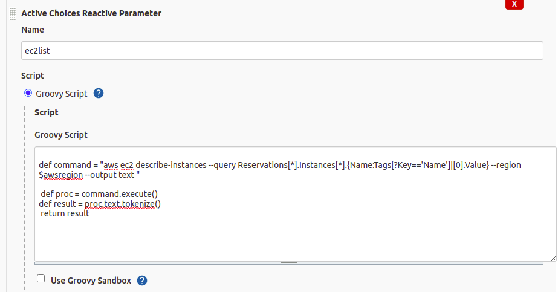
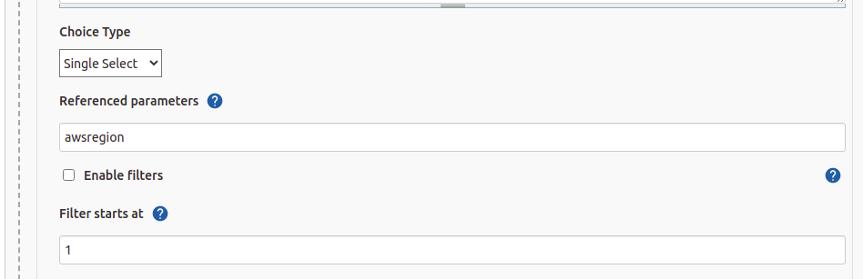
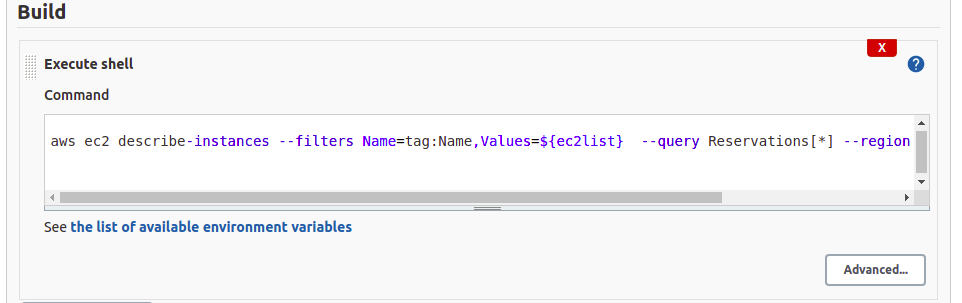

# List EC2 Data

In this task we will make a parametrized JENKINS job which will fetch the AWS Region and List the EC2 name present in that regions. Job will print all the information related to selected EC2 as the build result. 


## Prerequsites

 - [AWS CLI](https://docs.aws.amazon.com/cli/latest/userguide/getting-started-install.html)
 - [AWS CONFIGURE](https://docs.aws.amazon.com/cli/latest/userguide/cli-configure-quickstart.html)
 - [JENKINS](https://www.jenkins.io/doc/book/installing/)
   - [ACTIVE CHOICE PLUGIN](https://plugins.jenkins.io/uno-choice/)

#

## Important Points
Make sure Jenkins user should access the [AWS]().


For AWS access, run the aws configure command in the home directory of the Jenkins(/var/lib/jenkins -> default)
```bash
    aws configure
```
Install the [ACTIVE CHOICE PARAMETER](https://plugins.jenkins.io/uno-choice/) Plugin in the Jenkins


#
## Steps to create the Jenkins Job
1. Create a parameterized Freestyle job 
2. Configure the job
3. Create a Active Choices Parameter for list AWS Regions and paste the groovy script of the awsregion_variable_groovy_script.groovy file in the Groovy Script section.



4. Create a Active Choices Reactive Parameter for list EC2 name present in the selected region and paste the groovy script of the ec2list_variable_groovy_script.groovy file in the Groovy Script section.



and mention the reference of the above awsregion variables name



5. Choose the Execute Shell in the Build Section of the job and paste the below command
```bash
aws ec2 describe-instances --filters Name=tag:Name,Values=${ec2list}  --query Reservations[*] --region ${awsregion} --output json
```


#
## Author

- [Abkt2001](https://www.github.com/Abkt2001)
#

## Feedback

If you have any feedback, please reach out to us at LinkedIn
#

## 🔗 Links

[](https://www.linkedin.com/in/abhishek-kumar-tiwari-9b2539194)
[](https://twitter.com/)
#
