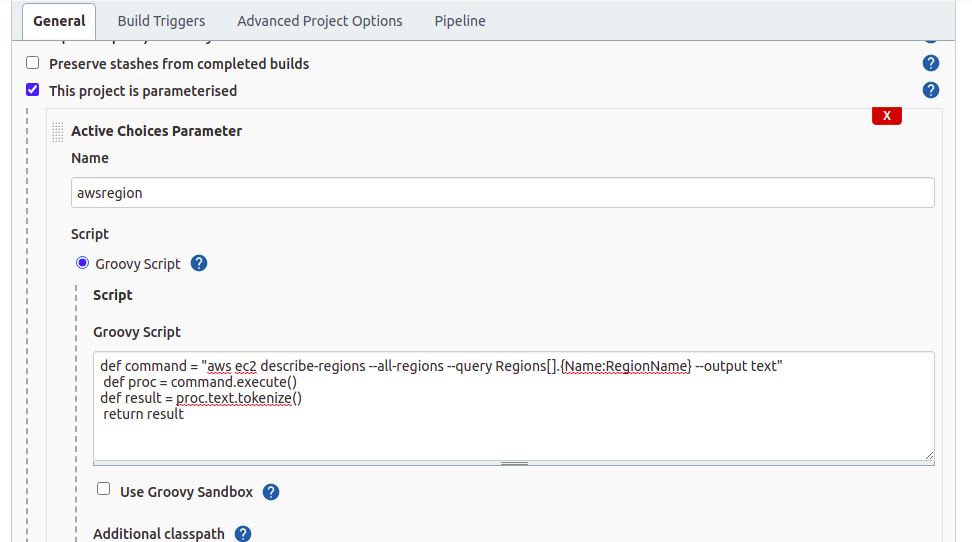
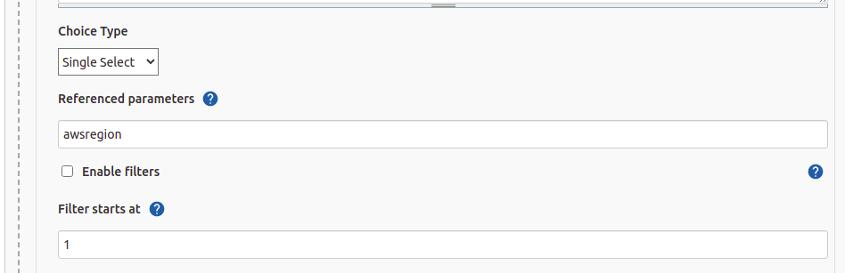
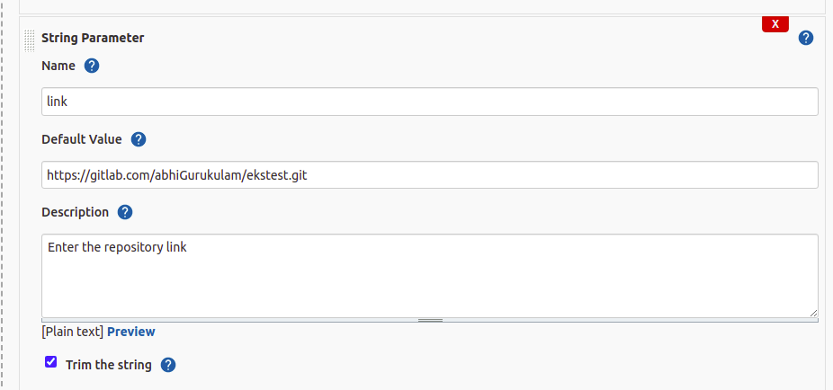
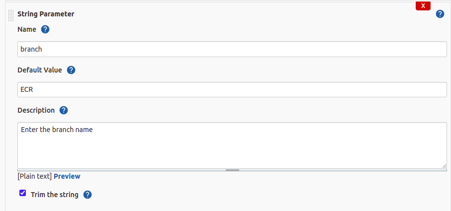
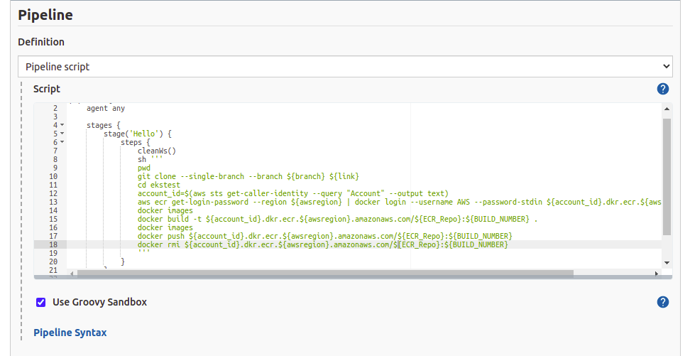

# IMAGES_PUSH_ON_ECR

In this task we will make a parametrized JENKINS job which will fetch the docker file from remote repository and buid it with proper tag and push on the AWS ECR


## Prerequsites

 - [Docker](https://docs.docker.com/engine/install/)
 - [AWS CLI](https://docs.aws.amazon.com/cli/latest/userguide/getting-started-install.html)
 - [AWS CONFIGURE](https://docs.aws.amazon.com/cli/latest/userguide/cli-configure-quickstart.html)
 - [JENKINS](https://www.jenkins.io/doc/book/installing/)
   - [ACTIVE CHOICE PLUGIN](https://plugins.jenkins.io/uno-choice/)

#

## Important Points
Make sure Jenkins user should access the [DOCKER]() and [AWS]().

May be you can find the error while running the docker command via Jenkins user.
```bash
  Got permission denied while trying to connect to the Docker daemon socket at unix:///var/run/docker.sock: Get http://%2Fvar%2Frun%2Fdocker.sock/v1.24/containers/json: dial unix /var/run/docker.sock: connect: permission denied
```
Add the Jenkins user in the docker group.

Run the command to add the Jenkins user in the docker group
```bash
    sudo usermod -a -G docker jenkins
```
For AWS access run the configure the AWS in the home directory of the Jenkins(/var/lib/jenkins -> default)
```bash
    aws configure
```
Install the [ACTIVE CHOICE PARAMETER](https://plugins.jenkins.io/uno-choice/) Plugin in the Jenkins


#
## Steps to create the Jenkins Job
1. Create a parameterized pipeline job 
2. Configure the job
3. Create a Active Choices Parameter for list AWS Regions and paste the groovy script of the awsregion_variable_groovy_script.groovy file



4. Create a Active Choices Reactive Parameter for list ECR Repository and paste the groovy script of the ECR_Reop_variable_groovy_script.groovyfile


and mention the reference of the above awsregion variables name



5. Create two String Parameter one for remote branch name and second for remote link





6. Create a pipeline that will push you images to ECR



#
## Author

- [Abkt2001](https://www.github.com/Abkt2001)
#

## Feedback

If you have any feedback, please reach out to us at LinkedIn
#

## 🔗 Links

[](https://www.linkedin.com/in/abhishek-kumar-tiwari-9b2539194)
[](https://twitter.com/)
#